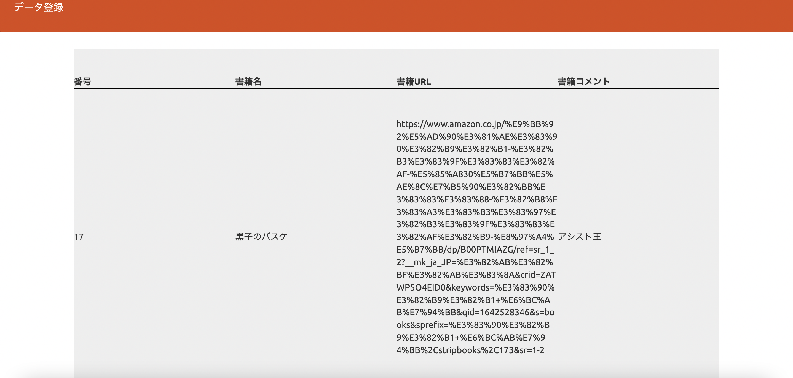
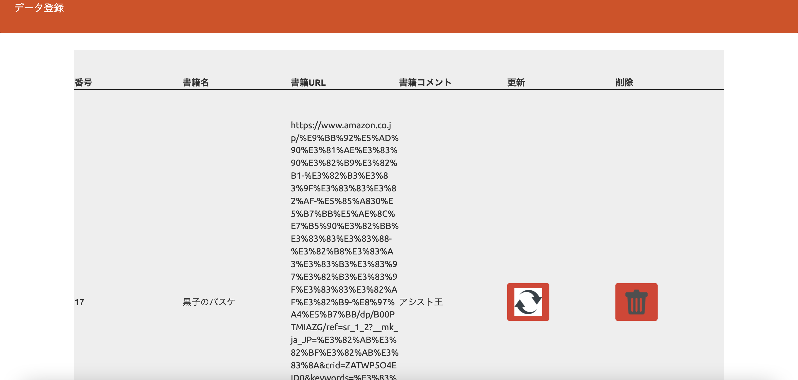

# １、課題内容

phpデータベースの課題(SESSIONの使用)。

# ２、工夫した点

- パスワードをhash化しています。

  パスワードはidと同じにしています。

# ３、参考にしたURL等

- [折り返し表示](https://qiita.com/gcyata/items/353658a7bdc1e7395337)

- 安藤先生のもくもく会とその翌日のアドバイス

  貴重なお時間をありがとうございました。大変参考になりました。

# 4、データベース情報

- データベース　 :gs_book_db

- テーブル　    :gs_bm_table

- 非管理者用画面(削除・更新が不可)

- 管理者用画面(削除・更新が可能)

